# Dynamics of Speed Dating: A Machine Learning Analysis of Match-Patterns

## Introduction
### Overview
The Speed Dating dataset, originally compiled by Sheena S. Iyengar, is being utilized for a final project to investigate decision-making in dating. This dataset was collected during a speed dating experiment conducted by professors from Columbia University, Harvard University, and Stanford University in New York City. The study aimed to observe how decision-making when dating varies between genders and races. This project's objective is to build classification models to determine whether two people are a match based on their characteristics. The binary response variable within the dataset is 'match,' equal to one when both parties like each other. This model has the potential to assist data scientists in the online dating industry by recommending highly compatible matches to users.

## Data Pre-Processing
The raw dataset consists of data from 21 controlled speed dating sessions, with 8378 different sample units and 195 columns of data. The goal for my modeling of the data is to create probabilities of a match based on the characteristics of a person and their potential partner. Therefore, I will be eliminating all the parameters that were specific to the experiment or created by the researcher. For example, there are many columns in the dataset based on participants' feedback during and after the experiment, and I am just going to focus on what they thought before. In addition, I will be taking out columns that pertain to the position of the participant during the experiment. Waves 6-9 of the experiment measured values differently than the other waves, so they were removed from the dataset.

In the dataset, each round of speed dating between two partners is represented by two rows: one represents the male, and the other represents the female. Therefore, we have double the rows needed and need to merge them so that each date is represented by only one row. The females were used as the principal, and their rows were merged together with the male data and renamed the columns to reflect this change. Data consistent within both datasets, such as interest correlation (intr_corr), was taken out of the male dataset so it was not represented in two columns.

To eliminate some missing values within the dataset, a category was made for the categorical variables for career and career field to represent a missing value as “another” career or career field. To make these variables more effective, instead of factoring the categorical variables, two binary variables were created to reflect if the couple had the same career or worked in the same field. Finally, decision and gender variables were removed due to perfect multicollinearity with the response.

## Data Analysis
Table 1 shows a summary of statistics for all the variables within the speed dating set used to build the models. Each variable has a corresponding description, mean, standard deviation, minimum value, and maximum value.
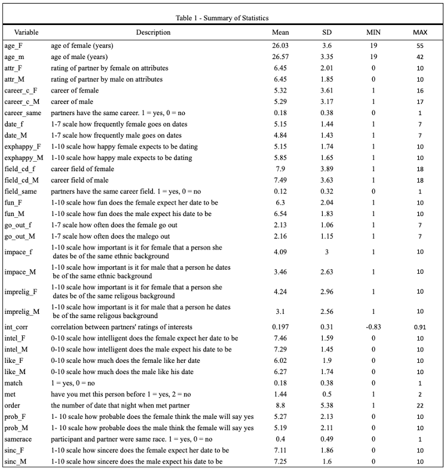

### Exploratory Visuals
Figure 1 shows the distribution of the binary response variable, match, with 1 representing a match and 0 representing not a match.
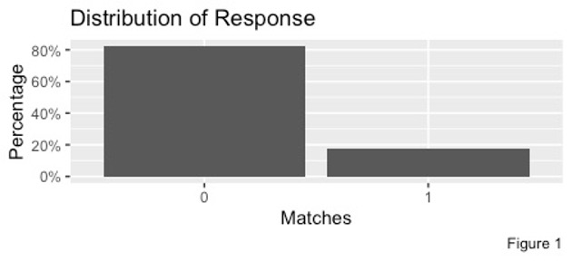

With approximately 1 out of 5 sample units being a match, 1 is the underrepresented group; however, the ratio, while not ideal, is sufficiently workable and within an acceptable range to proceed with classification. Figures 2 and 3 visualize the age distribution of people in the dating set.

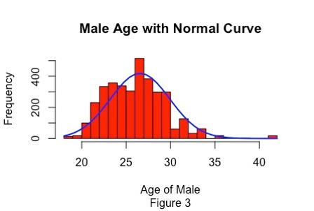

Through creating a normal curve, in Figure 2 the average female age from the study is 26, and in Figure 3 the average male age is also around 26. While the average age of the men is slightly more than women, there is more variance in the age of men; however, the maximum male age is only 42 while the maximum female age in the dataset is 55.

Figure 4 represents the change in match rate over order, or the number of dates they have met with that day.

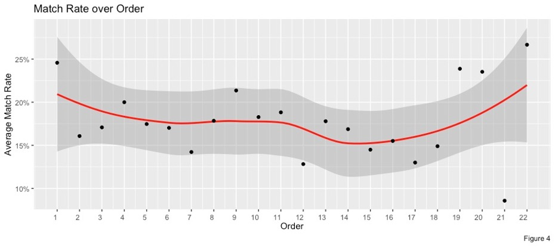

Each day of the study included meeting 22 people, so the order ranged from 1 – 22 in every sample unit. We see a decrease in the match rate from the first person they met until around 14, then we see a significant increase towards the end of the study. In a real-world setting, this could represent the number of profiles already seen by a user. Figure 5 and Figure 6 visualize the effects of having the same race and working in the same career field on matched couples.

Figure 5 shows that having the same career field has a minimal effect on matching with a partner; however, in Figure 6, around 40% of matches and non-matches were the same race.

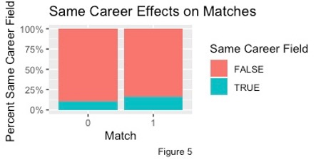
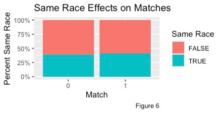

## Model Implementation
### Metrics
The metric used to measure the goodness-of-fit of each model explored within the project is test set accuracy. This yields an unbiased measure of model performance by using the model to predict 20% of the dataset not used in training the model.

The accuracy is calculated using the formula: **Add formula**

### Tree-Based Classification Methods
The initial tree-based method involved creating a single decision tree, where the response variable was "match," and all other variables were used as predictors. The resulting tree is illustrated in Figure 07 and was formed using a Cp value of 0.0095969 and training using the training set consisting of 80% of pre-processed sample units.

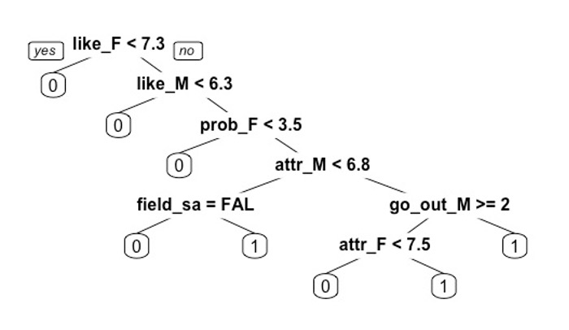

To optimize the tree, the original tree was first generated using the default Cp value. The package then generated a list of Cp values along with their corresponding cross-validation errors. The Cp value with the lowest cross-validation error was then selected, and the tree was re-run. This process was repeated with a list of Cp values with a smaller range until the optimal Cp value from the list matched the one used to create the original tree. Figure 08 displays the list of possible Cp values with their corresponding cross-validation errors and tree sizes.

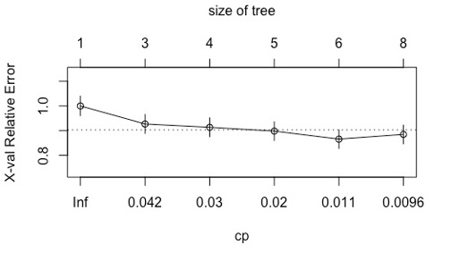

The test set accuracy of the single decision tree, depicted in Figure 07, is 86.3%. Figure 08	
To improve the single-tree method above, multi-tree methods were used to improve the accuracy of the tree model. First, a bagging method was used to create a model from multiple decision trees. For bagging, all 35 features were used to create each tree. The bagged decision tree had a test-set accuracy of 88.82%. From the model, the importance of each predictor contributing to the response was visualized in Figure 09. It is important to note the features deemed the most important through the bagged decision tree are included in the single, pruned decision tree.

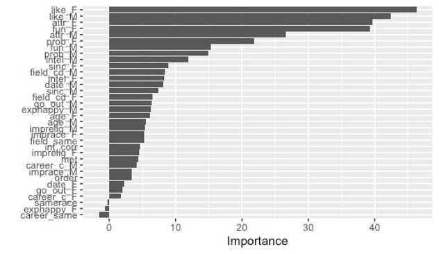

After a bagged decision tree, a random forest was made where only a third of the features were used to create each tree. The accuracy of this method was 88.5%, a slight decrease from the results from bagging. The advantage of using a random forest over bagging is the added variation through only using one-third of the predictors in each tree to prevent strong predictors in each tree. Therefore, since test set accuracy did not increase, there are no predictors that overpowered other predictors. However, as seen in Figure 10, predictors with less importance from the bagged decision tree have more importance in the random forest since they were used in more trees due to only using a third of the predictors.

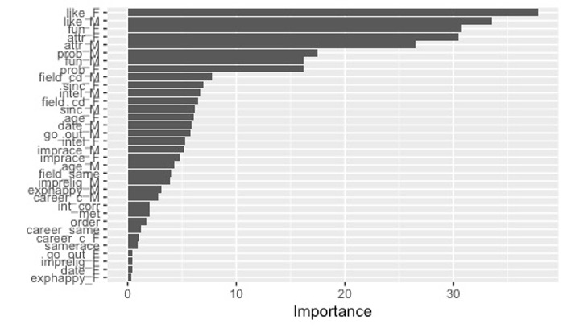

The final tree method used for classification was boosted decision tree. For this method, 5000 trees were formed at the optimal depth of 4. The boosted tree had a test set accuracy of 87.4% which is the least accurate from the multi-tree methods but more than the single tree.  
In Figure 11, the importance of each variable in the boosted tree is very similar to those in the random forest in Figure 10. 

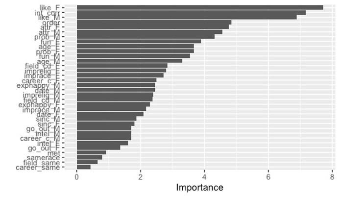

One of the main distinctions between the boosted tree and other tree models is the significance of int_corr and order. These variables were deemed insignificant in the single decision tree, random forest, and bagged tree models. However, in the boosted tree model, formed using residuals, int_corr and order were the second and fourth most important variables, respectively.

Table 2 compares the importance of variables within the dataset across different tree techniques. In the random forest and bagged tree models, the mean decrease Gini index was utilized to determine the importance level of each variable. The mean decrease Gini index assesses the extent to which each variable contributes to the homogeneity of the nodes and leaves. The Gini index plays a crucial role in the formation of splits in a random forest and bagged tree. Therefore, the greater the Gini index, the more important the variable.

However, in the boosted decision tree models, the Gini index cannot be employed to measure importance since the trees
are formed through residuals. Instead, the relative influence of each variable is used to determine its importance. The higher the relative influence, the more significant the variable.

